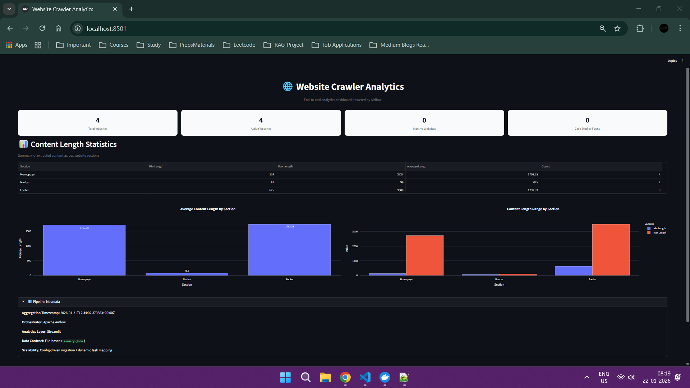
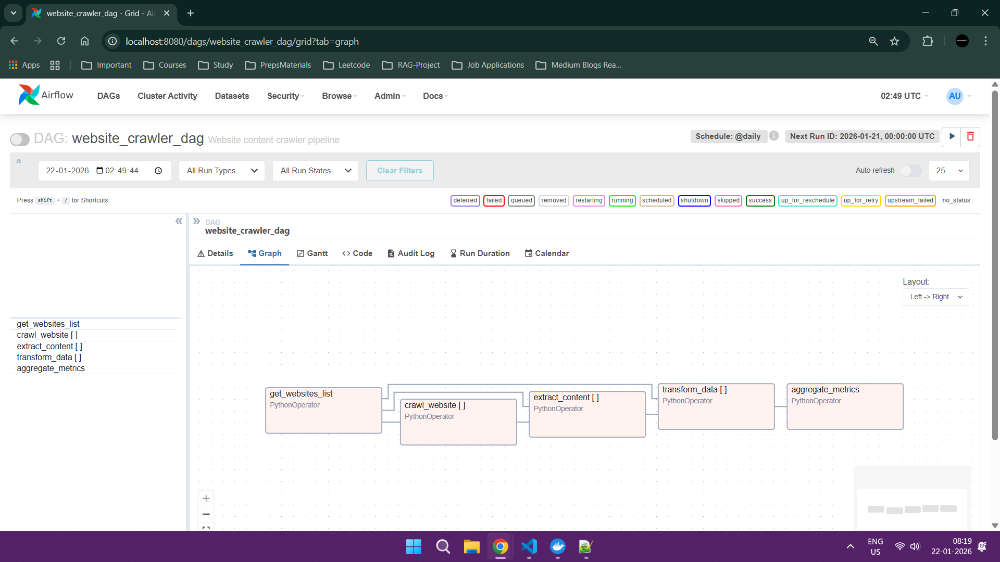

# 🌐 Scalable Website Crawling & Analytics Pipeline

A **production-ready, end-to-end data engineering pipeline** that crawls multiple websites, extracts structured content, aggregates analytics, and visualizes insights through a professional **Streamlit dashboard**, orchestrated using **Apache Airflow** and fully **Dockerized**.

This project is designed to demonstrate **real-world data engineering practices**, clean system architecture, and scalability-first thinking.

---

## Project Highlights

- Config-driven website crawling (scale from 1 → N websites)
- Dynamic task mapping using Apache Airflow
- Modular, maintainable Python codebase
- Aggregation layer producing analytics-ready metrics
- Decoupled Streamlit analytics dashboard
- Fully Dockerized and reproducible setup
- Developer-friendly workflow with Makefile

---
## Streamlit Analytics Dashboard

The project includes a modern, interactive analytics dashboard built with **Streamlit** that visualizes the crawled data and pipeline metrics in real time.

### Features
- KPI cards showing total/active/inactive websites and case studies found
- Section-wise content length statistics (min, max, average, count)
- Beautiful Plotly bar and range charts for homepage, navbar, footer, etc.
- Pipeline metadata display (timestamp, orchestrator, data contract)
- Fully responsive dark theme interface

The dashboard is **decoupled** from the pipeline — it only reads from `data/metrics/summary.json`, so you can scale or replace the backend without touching the UI.



## Airflow Pipeline Workflow

The end-to-end pipeline is orchestrated using **Apache Airflow** with **dynamic task mapping**, allowing it to scale to any number of websites defined in `config/websites.yaml` without code changes.

### Workflow Steps
1. `get_websites_list` — Loads websites from YAML config
2. `crawl_website[]` — Dynamic task: Crawls each website (parallel)
3. `extract_content[]` — Dynamic task: Parses homepage, navbar, footer, case studies
4. `transform_data[]` — Cleans and structures the extracted content
5. `aggregate_metrics` — Computes statistics and writes to `summary.json`


### DAG Graph View (from Airflow UI)



*Screenshot showing dynamic task mapping with PythonOperators for crawling, extraction, transformation, and aggregation.*

This graph shows the task dependencies and dynamic mapped tasks clearly.

**Schedule**: Daily (`@daily`) — but you can trigger manually anytime.

##  System Architecture

```text
websites.yaml (Config)
        ↓
Apache Airflow DAG
        ↓
Crawling → Extraction → Transformation
        ↓
Aggregation Layer
        ↓
summary.json (Data Contract)
        ↓
Streamlit Analytics Dashboard
```

### Key Design Principles
- Loose coupling between ETL and analytics
- Stable file-based data contract
- Config-based scalability (no code changes required)
- Independent service deployment

---

##  Project Structure

```text
## Project Structure
Data_Eng_Task/
├── dags/                           # Apache Airflow DAG definitions
│   └── website_crawler_dag.py      # Main DAG file: defines the end-to-end crawling pipeline with dynamic task mapping
│
├── src/                            # Core Python business logic (modular ETL components)
│   ├── __init__.py                 # Makes src a Python package
│   ├── crawler.py                  # Handles HTTP requests, rate limiting, and raw HTML fetching
│   ├── extractor.py                # Parses HTML using BeautifulSoup → extracts homepage, navbar, footer, case studies
│   ├── transformer.py              # Cleans, normalizes, and structures extracted content (length calc, text processing)
│   ├── aggregator.py               # Computes statistics (min/max/avg length per section) and writes summary.json
│   └── utils.py                    # Shared helpers (logging, file I/O, date utils, retry logic, etc.)
│
├── config/                         # Configuration files (no code changes needed to add websites)
│   └── websites.yaml               # List of target websites + global settings (rate limits, selectors, etc.)
│
├── data/                           # All persisted data (Airflow + Streamlit share this via volume)
│   ├── raw/                        # Optional: can store full HTML dumps per website (not used by default)
│   ├── processed/                  # Optional: can store cleaned per-website JSON/CSV (not used by default)
│   └── metrics/                    
│       └── summary.json            # Data contract / final output → consumed by Streamlit dashboard
│
├── streamlit_analytics/            # Independent analytics UI (decoupled from pipeline)
│   ├── app.py                      # Main Streamlit application (KPIs, charts, metadata display)
│   ├── Dockerfile                  # Builds the Streamlit container
│   └── requirements.txt            # Python dependencies for Streamlit + Plotly + Pandas
│
├── logs/                           # Airflow scheduler/webserver/task logs + pipeline execution logs from website_crawler_dag.py (volume-mounted for persistence & debugging)
│
├── docker-compose.yaml             # Defines services: airflow (webserver + scheduler + worker) + streamlit
├── Makefile                        # Developer-friendly shortcuts (build, up, down, logs, clean, etc.)
├── requirements.txt                # Base dependencies for Airflow DAG tasks (used in Dockerfile)
└── README.md                       # Project documentation (this file)
```

---

##  Technology Stack

| Layer | Technology |
|-----|-----------|
| Orchestration | Apache Airflow |
| Crawling | Python, Requests |
| Parsing | BeautifulSoup |
| Processing | Pandas |
| Analytics | Streamlit, Plotly |
| Configuration | YAML |
| Containerization | Docker, Docker Compose |

---

##  Airflow Pipeline Workflow

1. Load website configuration from `websites.yaml`
2. Dynamically crawl each website
3. Extract structured content (homepage, navbar, footer, case studies)
4. Transform and clean extracted data
5. Aggregate analytics and metrics
6. Persist output to `summary.json`

---

##  Analytics Dashboard (Streamlit)

The Streamlit application:

- Consumes `summary.json`
- Displays KPI cards and charts
- Provides section-wise content statistics
- Shows pipeline metadata for traceability

The analytics layer is **read-only and decoupled**, making it easy to replace or scale independently.

---

##  Dockerized Architecture

The system runs as two independent services:

### Airflow Service
- Scheduler and webserver
- Executes the crawling and aggregation pipeline

### Streamlit Service
- Serves analytics dashboard
- Reads shared output from `data/metrics/summary.json`

Both services communicate via a shared Docker volume.

---

##  How to Run the Project

### Prerequisites
- Docker (v20+)
- Docker Compose (v2+)
- Minimum 4 GB RAM allocated to Docker

---

### Clone the Repository

```bash
git clone https://github.com/AtharSayed/CrawlFlow.git
cd CrawlFlow
```

---

### Build and Start Services

```bash
docker compose up -d --build
```

---

### Access the Applications

| Service | URL |
|------|----|
| Airflow UI | http://localhost:8080 |
| Streamlit Dashboard | http://localhost:8501 |

**Airflow Credentials**
```
Username: admin
Password: admin
```

---

### Trigger the Pipeline

1. Open the Airflow UI
2. Enable `website_crawler_dag`
3. Trigger the DAG manually
4. Wait for all tasks to complete successfully
5. Refresh the Streamlit dashboard to view analytics

---

### Stop the Services

```bash
docker compose down
```

---

##  Makefile Commands

This project includes a Makefile for simplified operations.

| Command | Description |
|------|------------|
| `make build` | Build Docker images |
| `make up` | Start all services |
| `make down` | Stop all services |
| `make restart` | Restart services |
| `make dags-refresh` | Refresh Airflow DAGs |
| `make airflow-logs` | View Airflow logs |
| `make streamlit-logs` | View Streamlit logs |
| `make clean` | Remove containers and volumes |

---

##  Configuration

Edit `config/websites.yaml` to add or remove websites:

```yaml
websites:
  - https://www.apple.com
  - https://www.microsoft.com
  - https://www.amazon.com

rate_limit:
  requests_per_minute: 60
```

No code changes are required when scaling.

---

## Scalability & Extensibility

- Replace `summary.json` with PostgreSQL, DuckDB, or S3 + Parquet
- Replace Streamlit with Superset, Metabase, or Power BI
- Add alerting, historical metrics, or anomaly detection

The core pipeline remains unchanged.

---

##  Author

**Athar Sayed**  
MTech (Artificial Intelligence) | Data & AI Engineering  
Focused on building scalable, production-grade data and AI systems
---

## 📜 License

This project is intended for educational and portfolio use.
